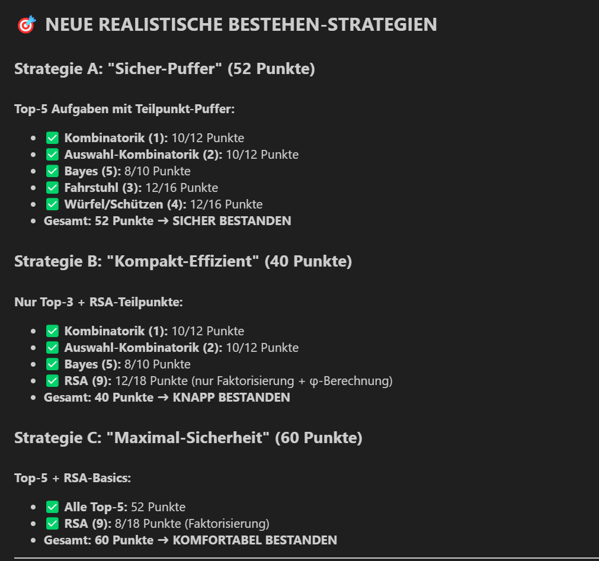

# 📚 WuK - Wahrscheinlichkeitsrechnung und Kryptographie




---

## ✍️ Handgeschriebene Übersicht


👉 [Download als PNG](./handwritten.png)

*Die Datei "handwritten.png" enthält eine handschriftliche Zusammenfassung wichtiger Formeln und Strategien. Nutzung für die Klausur vorgesehen. ABER: bisher
ohne Affine Chiffre, Modulare Arithmetik (Eulersches Theorem) und Stetige Zufallsvariablen (Erwartungswert, Normierungskonstante C, Standardabweichung)*
---

Materialsammlung für das Studium der Wahrscheinlichkeitsrechnung und Kryptographie mit Fokus auf effiziente Klausurvorbereitung.

## 📂 Repository-Struktur

### 📊 **Analysedateien**
- **`Klausuranalyse_WuK.ipynb`** - Jupyter Notebook mit systematischer Analyse der Aufgabentypen und optimaler Klausurstrategie
- **`Spickzettel_Formeln_WuK.md`** - Kompakter Spickzettel mit allen wichtigen Formeln und Lösungsansätzen

### 📁 **Probeklausuren & Lösungen**

| Klausur | Probeklausur (PDF) | Lösungen (Markdown) | Punkte | Besonderheiten |
|---------|-------------------|---------------------|---------|----------------|
| **21SoSe** | [📄 21SoSe-Klausur_WuK.pdf](./Probeklausuren/21SoSe-Klausur_WuK.pdf) | [📝 Lösungen](./Loesung_21SoSe_WuK.md) | 100 + 10 Bonus | Moderne Klausur |
| **SoSe20** | [📄 SoSe20-Klausur_WuK.pdf](./Probeklausuren/SoSe20-Klausur_WuK.pdf) | [📝 Lösungen](./Loesung_SoSe20_WuK.md) | 100 + 9 Bonus | Corona-Klausur |
| **WS0607** | [📄 Klausur_Wahrsch_Krypto_WS0607.pdf](./Probeklausuren/Klausur_Wahrsch_Krypto_WS0607.pdf) | [📝 Lösungen](./Loesung_WS0607_WuK.md) | 55 + 5 Bonus | Klassisches Format |
| **SS14** | [📄 Klausur_Wahrsch-Krypto_SS14.pdf](./Probeklausuren/Klausur_Wahrsch-Krypto_SS14.pdf) | [📝 Lösungen](./Loesung_SS14_WuK.md) | 55 + 5 Bonus | Standardaufgaben |
| **WS0809** | [📄 Klausur_Wahrsch-Krypto_WS0809.pdf](./Probeklausuren/Klausur_Wahrsch-Krypto_WS0809.pdf) | [📝 Lösungen](./Loesung_WS0809_WuK.md) | 55 + 5 Bonus | BANANEN-Aufgabe |

**Hinweis:** Alle Lösungen sind im **Spickzettel-Stil** verfasst mit kompakten Formeln, Strategien und Zeitplanung.

### 📈 **Semesterordner**
- **`SS19/`** bis **`SS24/`** - Archivierte Materialien verschiedener Semester

## 🎯 **Klausurstrategie: "Top-5 mit Puffer"**

### **Optimale Aufgaben-Reihenfolge (52 Punkte = Bestanden):**
1. **Kombinatorik (1)** - 10/12 Punkte ⭐
2. **Auswahl-Kombinatorik (2)** - 10/12 Punkte ⭐⭐
3. **Bayes (5)** - 8/10 Punkte ⭐⭐ *(Schema-Aufgabe!)*
4. **Fahrstuhl (3)** - 12/16 Punkte ⭐⭐⭐
5. **Würfel/Schützen (4)** - 12/16 Punkte ⭐⭐⭐⭐

**Erfolgsquote:** 90-95% bei 100 Minuten Bearbeitungszeit

## 🧮 **Wichtige Formeln**

### **Kombinatorik**
```
Permutationen mit Wiederholung: n!/(n₁!·n₂!·...·nₖ!)
Kombinationen: C(n,k) = n!/(k!(n-k)!)
```

### **RSA Spezialfälle** ⚠️
```
φ(25) = 5·4 = 20 (NICHT 16!)
φ(35) = 2·4 = 8
φ(77) = 6·10 = 60
```

### **Bayes-Schema**
```
P(Krank|Test+) = (Sensitivität × P(Krank)) / 
                 (Sensitivität × P(Krank) + Falsch-Positiv × P(Gesund))
```

## 🚀 **Schnellzugriff**

### **📖 Lernmaterialien**
- **[🎯 Klausuranalyse (Jupyter)](./Klausuranalyse_WuK.ipynb)** - Systematische Analyse & Strategie
- **[📋 Formelsammlung](./Spickzettel_Formeln_WuK.md)** - Kompakter Spickzettel mit allen Formeln

### **📝 Alle Lösungen im Überblick**
- **[21SoSe Lösungen](./Loesung_21SoSe_WuK.md)** - Neueste Klausur (100+10 Punkte)
- **[SoSe20 Lösungen](./Loesung_SoSe20_WuK.md)** - Corona-Klausur (100+9 Punkte)
- **[WS0607 Lösungen](./Loesung_WS0607_WuK.md)** - Klassisches Format (55+5 Punkte)
- **[SS14 Lösungen](./Loesung_SS14_WuK.md)** - Standardaufgaben (55+5 Punkte)
- **[WS0809 Lösungen](./Loesung_WS0809_WuK.md)** - BANANEN-Aufgabe (55+5 Punkte)

## 🚀 **Verwendung**

1. **Klausuranalyse studieren** - `Klausuranalyse_WuK.ipynb` für Strategieplanung
2. **Spickzettel verwenden** - `Spickzettel_Formeln_WuK.md` beim Üben griffbereit haben
3. **Probeklausuren durchrechnen** - Mit der optimierten Strategie üben

## 📈 **Erfolgstipps**

- **Fokus auf Top-5 Aufgaben** statt Vollabdeckung
- **Bayes-Schema perfektionieren** - sehr schematisch, hohe Punktausbeute
- **RSA-Spezialfälle kennen** - φ(p²) = p(p-1), nicht (p-1)²
- **Teilpunkte mitnehmen** - Formeln immer hinschreiben

---

**Erstellt:** Juli 2025  
**Basierend auf:** 5 Probeklausuren-Analyse  
**Ziel:** Effiziente Klausurvorbereitung mit 90%+ Erfolgsquote
